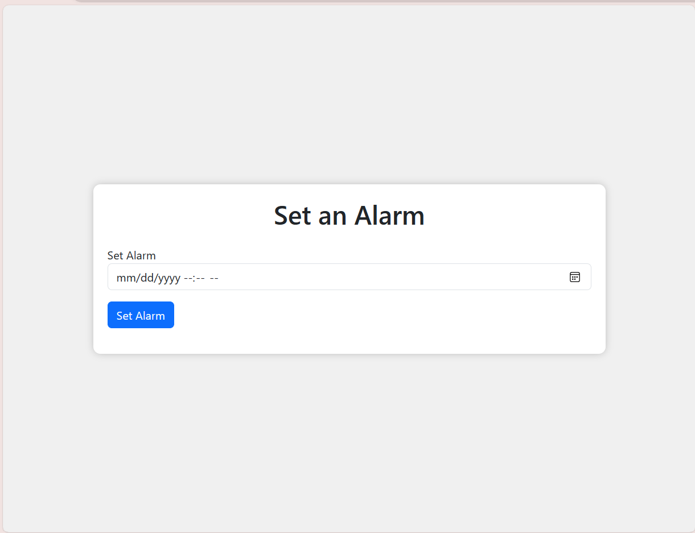

# Basic Alarm Clock using HTML, CSS, and JavaScript

## Overview

This web-based Basic Alarm Clock allows users to easily set alarms in a user-friendly interface. It's built using HTML, CSS, and JavaScript.

## Features

- Set alarms with a simple datetime input field.
- Get feedback with success and warning alerts.
- Intuitive format reminder for alarm input.
- Responsive and visually appealing design.

## Getting Started

To use the Alarm Clock, follow these steps:

1. **Open the Alarm Clock**: Open the `index.html` file in your preferred web browser.

2. **Set the Alarm**:
   - Enter the desired alarm time from the `Datetime Input`.
   - Click the "Set Alarm" button.

3. **Receive Feedback**:
   - You will receive feedback via success and warning alerts.

4. **Wait for the Alarm**:
   - Wait for the alarm to ring at the specified time.

## Contributing

Contributions are welcome! Feel free to open issues or pull requests to improve this Basic Alarm Clock.

## License

This project is licensed under the Apache License.
